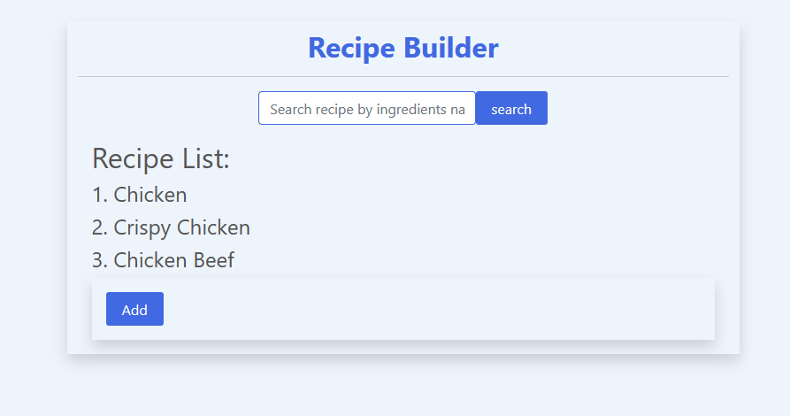
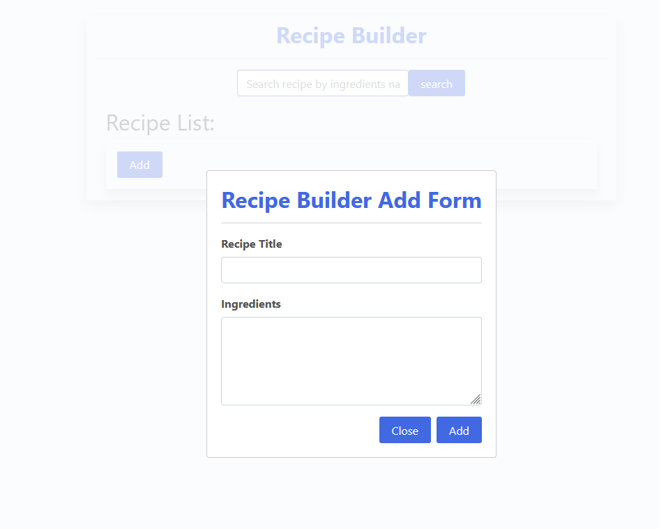
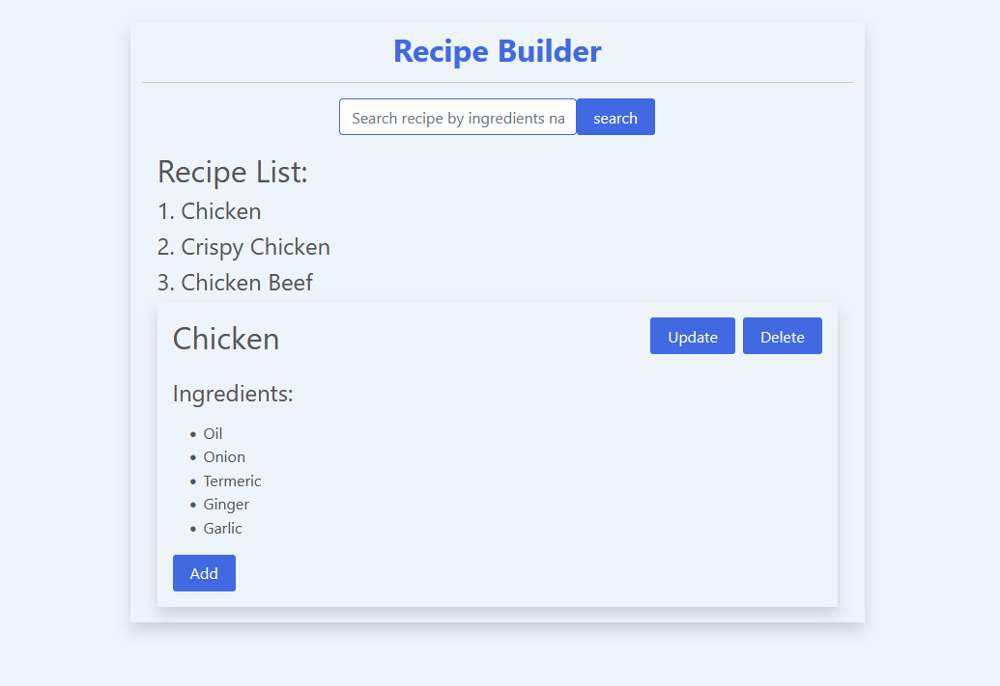

# Recipe Builder

# Features 
- User can create recipe by name and ingredients
- By clicking on the created recipe name user can see recipes ingredients.
- User can update recipes name and ingredients.
- User can search Recipe by recipes ingredients.
- Recipe do not delete if refresh the webpage.

##Recipe Builder form

##Show recipe details

##Recipe updating form

###  `Demo Video :` [YouTube](https://youtu.be/1rhBTBeLugI)
###  `Website Link :` [Live Site](https://competent-perlman-5dc8af.netlify.app/)